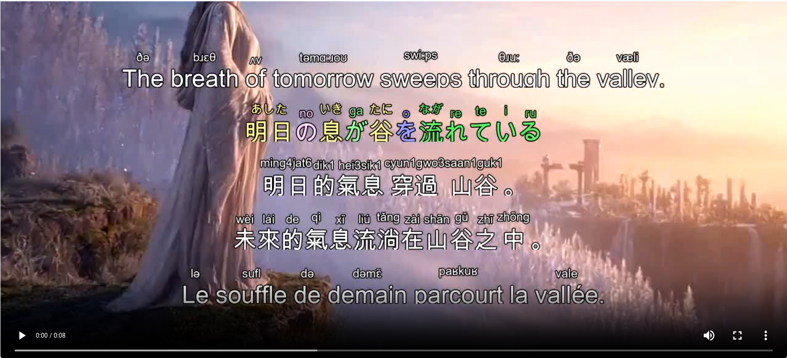

<p align="center">
  
</p>

<p align="center">
  
</p>

<p>
  <b>Languages:</b>
  <a href="README.md">English</a>
  · <a href="i18n/README.zh-Hant.md">中文（繁體）</a>
  · <a href="i18n/README.zh-Hans.md">中文 (简体)</a>
  · <a href="i18n/README.ja.md">日本語</a>
  · <a href="i18n/README.ko.md">한국어</a>
  · <a href="i18n/README.vi.md">Tiếng Việt</a>
  · <a href="i18n/README.ar.md">العربية</a>
  · <a href="i18n/README.fr.md">Français</a>
  · <a href="i18n/README.es.md">Español</a>
</p>

# Furigana Subtitle Burner

A Python application that burns Japanese subtitles with furigana (pronunciation guides) directly onto video files without using ffmpeg.

## Features

- 🎌 **Automatic Furigana Generation**: Uses MeCab (fugashi) or pykakasi to generate furigana for kanji characters
- 🎨 **Custom Text Rendering**: Renders beautiful furigana above kanji with proper spacing and alignment
- 📺 **Direct Video Processing**: Burns subtitles directly onto video frames using OpenCV
- 🔤 **Smart Font Handling**: Automatically finds and uses Japanese fonts on your system
- ⚡ **Batch Processing**: Process multiple videos at once
- 🎯 **Precise Positioning**: Configurable subtitle position and margins

## Installation

### Quick Setup
```bash
chmod +x setup_furigana.sh
./setup_furigana.sh
```

### Manual Installation
```bash
# Install required packages
pip install opencv-python Pillow numpy fugashi unidic pykakasi

# Download Japanese dictionary data
python -c "import unidic; unidic.download()"
```

## Usage

### 1. Test the System
```bash
python test_furigana.py
```
This will test furigana generation and create a sample image showing how the text will look.

### 2. Process All Videos in Current Directory
```bash
python process_furigana_videos.py
```
Automatically finds all video directories and processes them with their SRT files.

### 3. Process a Single Video
```bash
python process_furigana_videos.py input_video.mp4 subtitles.srt output_video.mp4
```

### 4. Advanced Usage
```bash
python furigana_subtitle_burner.py video.mp4 subtitles.srt output.mp4 \
    --main-font-size 64 \
    --furigana-font-size 32 \
    --position bottom \
    --margin 80
```

## How It Works

### 1. Furigana Generation
The system uses multiple methods to generate furigana:

- **Primary**: MeCab with fugashi for accurate morphological analysis
- **Fallback**: pykakasi for basic kanji-to-hiragana conversion
- **Last Resort**: Character-by-character analysis

### 2. Text Rendering Strategy
- Measures each character and its furigana separately
- Calculates optimal column width for each character
- Centers furigana above corresponding kanji
- Adds text stroke for better visibility

### 3. Video Processing
- Reads video frame by frame using OpenCV
- Calculates subtitle timing based on SRT timestamps
- Renders furigana text as RGBA image
- Alpha-blends subtitle onto video frame
- Writes processed frame to output video

## Example Output

For the text "今日は空が晴れていて":
```
   きょう   そら    は
   今日  は 空  が 晴れていて
```

## File Structure

After processing, your directory will look like:
```
video_577285345205551192-yFQ1pMPA/
├── video_577285345205551192-yFQ1pMPA.MP4      # Original video
├── video_577285345205551192-yFQ1pMPA.srt      # Subtitle file
├── video_577285345205551192-yFQ1pMPA.json     # Whisper output
├── video_577285345205551192-yFQ1pMPA.wav      # Audio extraction
└── video_577285345205551192-yFQ1pMPA_furigana.mp4  # Output with furigana
```

## Customization

### Font Sizes
- `--main-font-size`: Size of main Japanese text (default: 48)
- `--furigana-font-size`: Size of furigana text (default: 24)

### Positioning
- `--position`: `top`, `bottom`, or `center`
- `--margin`: Distance from edge in pixels

### Text Appearance
- White text with black stroke for maximum visibility
- Automatic font selection (tries system Japanese fonts)
- Proportional spacing between characters and furigana

## Troubleshooting

### No Japanese Fonts Found
The system tries to find Japanese fonts automatically:
- **macOS**: Hiragino Sans
- **Linux**: fonts-japanese-gothic
- **Windows**: MS Gothic

Install Japanese fonts if subtitles appear in default font.

### Furigana Not Generated
1. Check if fugashi/unidic is installed: `python -c "import fugashi; print('OK')"`
2. Fallback to pykakasi: `python -c "import pykakasi; print('OK')"`
3. Check test output: `python test_furigana.py`

### Video Processing Errors
- Ensure input video is readable by OpenCV
- Check available disk space for output file
- Verify SRT file encoding is UTF-8

## Performance

- Processing speed depends on video resolution and length
- Typical speeds: 10-30 fps processing rate
- Memory usage scales with video resolution
- Uses single-threaded processing (can be parallelized)

## Dependencies

- **opencv-python**: Video processing
- **Pillow**: Image rendering and text drawing
- **numpy**: Array operations
- **fugashi**: Japanese morphological analysis (optional but recommended)
- **unidic**: Japanese dictionary data (optional but recommended)
- **pykakasi**: Kanji to hiragana conversion (fallback)

## Known Limitations

- Processing is CPU-intensive (no GPU acceleration)
- Font selection is automatic (limited manual control)
- Furigana distribution for complex words may not be perfect
- No support for vertical text layout
- Single subtitle line only (no multi-line support yet)

## What your support makes possible

- <b>Keep tools open</b>: hosting, inference, data storage, and community ops.  
- <b>Ship faster</b>: weeks of focused open-source time on EchoMind, LazyEdit, and MultilingualWhisper.  
- <b>Prototype wearables</b>: optics, sensors, and neuromorphic/edge components for IdeasGlass + LightMind.  
- <b>Access for all</b>: subsidized deployments for students, creators, and community groups.

### Donate

<div align="center">
<table style="margin:0 auto; text-align:center; border-collapse:collapse;">
  <tr>
    <td style="text-align:center; vertical-align:middle; padding:6px 12px;">
      <a href="https://chat.lazying.art/donate">https://chat.lazying.art/donate</a>
    </td>
    <td style="text-align:center; vertical-align:middle; padding:6px 12px;">
      <a href="https://chat.lazying.art/donate"></a>
    </td>
  </tr>
  <tr>
    <td style="text-align:center; vertical-align:middle; padding:6px 12px;">
      <a href="https://paypal.me/RongzhouChen">
        
      </a>
    </td>
    <td style="text-align:center; vertical-align:middle; padding:6px 12px;">
      <a href="https://buy.stripe.com/aFadR8gIaflgfQV6T4fw400">
        
      </a>
    </td>
  </tr>
  <tr>
    <td style="text-align:center; vertical-align:middle; padding:6px 12px;"><strong>WeChat</strong></td>
    <td style="text-align:center; vertical-align:middle; padding:6px 12px;"><strong>Alipay</strong></td>
  </tr>
  <tr>
    <td style="text-align:center; vertical-align:middle; padding:6px 12px;"></td>
    <td style="text-align:center; vertical-align:middle; padding:6px 12px;"></td>
  </tr>
</table>
</div>

**支援 / Donate**

- ご支援は研究・開発と運用の継続に役立ち、より多くのオープンなプロジェクトを皆さんに届ける力になります。  
- 你的支持将用于研发与运维，帮助我持续公开分享更多项目与改进。  
- Your support sustains my research, development, and ops so I can keep sharing more open projects and improvements.

## Contributing

Feel free to improve the furigana generation algorithm, add support for more text layouts, or optimize the video processing pipeline.
