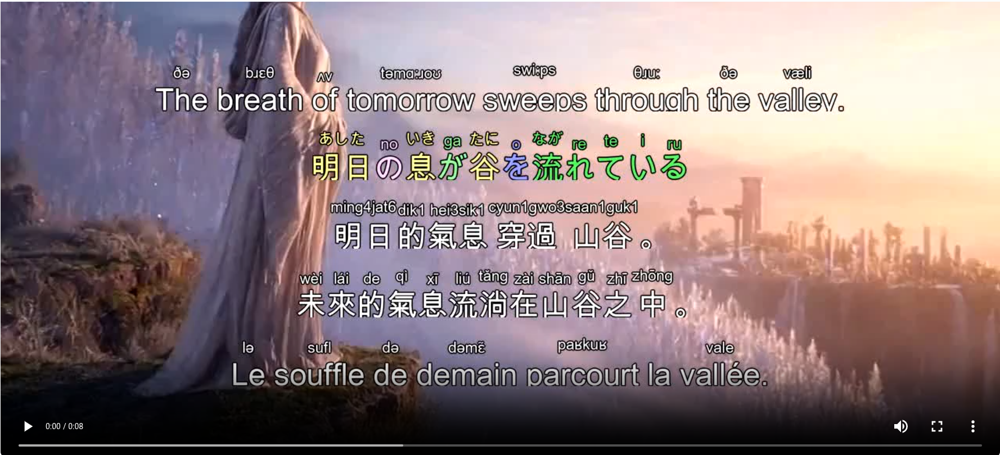

[English](../README.md) · [العربية](README.ar.md) · [Español](README.es.md) · [Français](README.fr.md) · [日本語](README.ja.md) · [한국어](README.ko.md) · [Tiếng Việt](README.vi.md) · [中文 (简体)](README.zh-Hans.md) · [中文（繁體）](README.zh-Hant.md) · [Deutsch](README.de.md) · [Русский](README.ru.md)


<p align="center">
  
</p>

# Furigana 字幕烧录器

<p align="center">
  
</p>

<p align="center">
  
  
  
  
  
</p>

这是一个 Python 字幕烧录工具，使用 OpenCV 将日语振假名（furigana）及其他 ruby 注释（如拼音、罗马音、IPA 等）直接渲染到视频帧上。它针对 furigana 工作流进行了优化，同时也保持了对多语言 ruby 风格字幕的灵活支持。

Built for <a href="https://studio.lazying.art" target="_blank" rel="noreferrer">LazyEdit Studio</a> · <a href="https://github.com/lachlanchen/LazyEdit" target="_blank" rel="noreferrer">GitHub</a>

## 目录

- [概览](#概览)
- [功能特性](#功能特性)
- [项目结构](#项目结构)
- [前置条件](#前置条件)
- [安装](#安装)
- [使用方法](#使用方法)
- [配置](#配置)
- [示例](#示例)
- [工作原理](#工作原理)
- [开发说明](#开发说明)
- [故障排查](#故障排查)
- [性能](#性能)
- [依赖](#依赖)
- [已知限制](#已知限制)
- [路线图](#路线图)
- [你的支持可以实现什么](#你的支持可以实现什么)
- [贡献](#贡献)
- [许可证](#许可证)

## 概览

本仓库包含多条字幕烧录路径：

| 路径 | 脚本 | 适用场景 |
|---|---|---|
| 经典 SRT furigana 工作流 | `process_furigana_videos.py` + `furigana_subtitle_burner.py` | 日常使用 SRT 文件进行字幕烧录 |
| 独立工作流 | `standalone_furigana_burner.py` | 简单单脚本执行 |
| 完整工作流 | `complete_furigana_burner.py` | 配置保存/加载 + 预览模式 |
| 通用 ruby 引擎 | `subtitles_burner/burner.py` | 基于 JSON、支持多语言的 token 级注释 |

除非你明确需要基于 JSON 的多槽位渲染，否则 README 默认流程仍是基于 SRT 的管线。

## 功能特性

- 🎌 **自动生成 Furigana**：使用 MeCab（fugashi）或 pykakasi 为汉字生成 furigana
- 🌐 **Ruby 注释支持**：可为汉字、假名及其他文字系统渲染发音注释（拼音、罗马音、IPA）
- 🎨 **可定制文本渲染**：以合适的间距、对齐和描边渲染美观的 ruby 文本
- 📺 **直接处理视频**：通过 OpenCV 将字幕直接烧录到视频帧
- 🔤 **智能字体处理**：自动查找并使用 CJK 与拉丁文字字体
- ⚡ **批量处理**：一次处理多个视频
- 🎯 **精确定位**：可配置字幕位置、边距与布局行为
- 🧩 **多种运行方式**：可在 classic、standalone、complete 或 generalized 模块间选择

## 项目结构

```text
FuriganaSubtitles/
├── README.md
├── requirements.txt
├── setup_furigana.sh
├── process_furigana_videos.py
├── furigana_subtitle_burner.py
├── standalone_furigana_burner.py
├── complete_furigana_burner.py
├── subtitles_burner/
│   ├── __init__.py
│   ├── burner.py
│   └── assets/
│       └── speaker.png
├── i18n/
│   ├── README.ar.md
│   ├── README.es.md
│   ├── README.fr.md
│   ├── README.ja.md
│   ├── README.ko.md
│   ├── README.vi.md
│   ├── README.zh-Hans.md
│   └── README.zh-Hant.md
├── figures/
│   └── demo.png
├── .github/
│   └── FUNDING.yml
├── legacy/
├── legacy-results/
├── test_furigana.py
├── simple_test.py
├── font_test.py
├── fix_font_squares.py
├── fix_unidic.py
├── debug_japanese.py
└── openai_request.py
```

## 前置条件

- 建议使用 Python 3.9+
- 操作系统需具备可渲染日文/CJK 文本的字体
- 具备足够的 CPU 与磁盘空间用于逐帧视频输出
- 输入字幕文件建议使用 UTF-8 编码

## 安装

### 快速安装

```bash
chmod +x setup_furigana.sh
./setup_furigana.sh
```

安装脚本会安装核心依赖、尝试下载 UniDic，并运行 `test_furigana.py`。

### 手动安装

```bash
# Option A: install pinned repo requirements
pip install -r requirements.txt

# Option B: install explicit core packages (as documented in original README)
pip install opencv-python Pillow numpy fugashi unidic pykakasi

# Download Japanese dictionary data
python -c "import unidic; unidic.download()"
```

`subtitles_burner/burner.py` 使用的可选依赖（仅在特定转写模式下需要）：

```bash
pip install phonemizer koroman pypinyin pycantonese
```

`openai_request.py` 辅助脚本使用的可选依赖：

```bash
pip install openai pygame
```

## 使用方法

### 1. 测试系统

```bash
python test_furigana.py
```

这会测试 furigana 生成功能，并创建 `test_furigana_output.png`。

### 2. 处理当前目录中的所有视频

```bash
python process_furigana_videos.py
```

会自动查找所有 `video_*` 目录，并处理每个目录中的第一个 `.MP4` 与 `.srt` 文件。

### 3. 处理单个视频

```bash
python process_furigana_videos.py input_video.mp4 subtitles.srt output_video.mp4
```

### 4. 高级用法（经典烧录器）

```bash
python furigana_subtitle_burner.py video.mp4 subtitles.srt output.mp4 \
    --main-font-size 64 \
    --furigana-font-size 32 \
    --position bottom \
    --margin 80
```

### 5. 独立烧录器（自动检测模式）

```bash
python standalone_furigana_burner.py
```

若不带参数运行，它会自动检测当前目录中的 `*.MP4`/`*.mp4` 与 `*.srt`。

### 6. 完整烧录器（配置 + 预览）

```bash
python complete_furigana_burner.py video.mp4 sub.srt out.mp4 --preview
python complete_furigana_burner.py video.mp4 sub.srt out.mp4 --save-config
python complete_furigana_burner.py --config furigana_config.json video.mp4 sub.srt out.mp4
```

### 7. 通用 JSON Ruby 烧录器

```bash
python subtitles_burner/burner.py input.mp4 subtitles.json output.mp4 \
  --text-key text \
  --ruby-key ruby \
  --slot 1 \
  --auto-ruby
```

## 配置

### CLI 参数（经典 `furigana_subtitle_burner.py`）

| 参数 | 说明 | 默认值 |
|---|---|---|
| `--main-font-size` | 主日文文本字号 | `48` |
| `--furigana-font-size` | furigana 字号 | `24` |
| `--position` | `top`、`bottom` 或 `center` | `bottom` |
| `--margin` | 与边缘的像素距离 | `50` |

### CLI 参数（`standalone_furigana_burner.py`）

| 参数 | 说明 | 默认值 |
|---|---|---|
| `--main-font-size` | 主文本字号 | `64` |
| `--furigana-font-size` | furigana 字号 | `32` |
| `--position` | `top`、`bottom` 或 `center` | `bottom` |
| `--margin` | 与边缘的距离 | `80` |

### CLI 参数（`complete_furigana_burner.py`）

| 参数 | 说明 | 默认值 |
|---|---|---|
| `--main-font-size` | 主文本字号 | `64` |
| `--furigana-font-size` | furigana 字号 | `32` |
| `--position` | `top`、`bottom` 或 `center` | `bottom` |
| `--margin` | 与边缘的距离 | `80` |
| `--preview` | 预览模式（前约 10 秒） | Off |
| `--config <path>` | 加载配置文件 | `None` |
| `--save-config` | 将当前配置保存为默认值 | Off |

### CLI 参数（`subtitles_burner/burner.py`）

| 参数 | 说明 | 默认值 |
|---|---|---|
| `--text-key` | 基础文本的 JSON 键名 | `text` |
| `--ruby-key` | ruby 标记的 JSON 键名 | `None` |
| `--slot` | 底部槽位布局中的槽位 ID | `1` |
| `--auto-ruby` | 为日文自动生成 ruby | Off |

### 文本外观

- 白字黑描边，最大化可读性
- 自动字体选择（会尝试系统日文字体）
- 字符与 furigana 之间按比例间距排布

## 示例

### 输出示例

对于文本 `今日は空が晴れていて`：

```text
   きょう   そら    は
   今日  は 空  が 晴れていて
```

### 批处理输入/输出目录示例

处理完成后，目录结构如下：

```text
video_577285345205551192-yFQ1pMPA/
├── video_577285345205551192-yFQ1pMPA.MP4      # Original video
├── video_577285345205551192-yFQ1pMPA.srt      # Subtitle file
├── video_577285345205551192-yFQ1pMPA.json     # Whisper output
├── video_577285345205551192-yFQ1pMPA.wav      # Audio extraction
└── video_577285345205551192-yFQ1pMPA_furigana.mp4  # Output with furigana
```

## 工作原理

### 1. Furigana 生成

系统使用多种方法生成 furigana：

- **主要方案**：MeCab + fugashi，提供更准确的形态学分析
- **回退方案**：pykakasi，进行基础汉字转平假名
- **最后兜底**：逐字符分析

### 2. 文本渲染策略

- 分别测量每个字符及其 furigana
- 为每个字符计算最佳列宽
- 将 furigana 居中放置在对应汉字上方
- 添加描边以提升可见性

### 3. 视频处理

- 使用 OpenCV 逐帧读取视频
- 基于 SRT 时间戳计算字幕时序
- 将 furigana 文本渲染为 RGBA 图像
- 将字幕进行 Alpha 混合叠加到视频帧
- 将处理后的帧写入输出视频

## 开发说明

- 仓库中有多个功能重叠的烧录器，这是有意设计；日常使用以 SRT 管线最简便。
- `legacy/` 与 `legacy-results/` 为归档内容，适合用于回归对比。
- 当前没有打包元数据（`pyproject.toml` / `setup.py`）。
- 测试覆盖以脚本为主（`test_furigana.py`、`simple_test.py`、`font_test.py`），而非正式测试框架。
- `openai_request.py` 是辅助工具，不是核心字幕烧录流程的必需项。

## 故障排查

### 找不到日文字体

系统会自动尝试查找日文字体：

- **macOS**：Hiragino Sans
- **Linux**：`fonts-japanese-gothic`
- **Windows**：MS Gothic

如果字幕显示为默认字体，请先安装日文字体。

额外辅助脚本：

```bash
python font_test.py
python fix_font_squares.py
```

### 未生成 Furigana

1. 检查 fugashi/unidic 是否安装：`python -c "import fugashi; print('OK')"`
2. 回退检查 pykakasi：`python -c "import pykakasi; print('OK')"`
3. 检查测试输出：`python test_furigana.py`
4. 运行依赖诊断：`python fix_unidic.py` 与 `python debug_japanese.py`

### 视频处理报错

- 确保 OpenCV 能正常读取输入视频
- 检查磁盘剩余空间是否足够写入输出文件
- 确认 SRT 文件编码为 UTF-8
- 可先用 `complete_furigana_burner.py --preview ...` 快速验证流程

## 性能

- 处理速度取决于视频分辨率与时长
- 常见速度：约 10-30 fps
- 内存占用会随视频分辨率提升而增加
- 当前为单线程处理（可并行化）

## 依赖

| Package | 作用 | 说明 |
|---|---|---|
| `opencv-python` | 视频处理 | 核心依赖 |
| `Pillow` | 图像渲染与文本绘制 | 核心依赖 |
| `numpy` | 数组运算 | 核心依赖 |
| `fugashi` | 日语形态学分析 | 可选但推荐 |
| `unidic` | 日语词典数据 | 可选但推荐 |
| `pykakasi` | 汉字转平假名 | 回退路径 |
| `camel-tools` | 阿拉伯语转写辅助 | 已包含在 `requirements.txt`，用于通用烧录器模式 |

## 已知限制

- 处理较吃 CPU（暂无 GPU 加速）
- 字体选择为自动模式（手动控制有限）
- 复杂词语的 furigana 分配可能不够完美
- 不支持竖排文本布局
- 目前仅支持单行字幕（尚未支持多行）

## 路线图

- 改进复杂多汉字词语的 furigana 对齐与分配
- 扩展多行字幕排版选项
- 更清晰地区分 classic/standalone/complete/generalized 运行配置
- 可选地补充打包与测试自动化（`pyproject.toml`、CI smoke checks）

## 你的支持可以实现什么

- <b>让工具持续开放</b>：支持托管、推理、数据存储和社区运营。
- <b>加快交付节奏</b>：为 EchoMind、LazyEdit、MultilingualWhisper 提供数周持续开源开发时间。
- <b>推进可穿戴原型</b>：支持 IdeasGlass + LightMind 的光学、传感器及神经形态/边缘组件。
- <b>让更多人可用</b>：为学生、创作者与社区团体提供补贴部署。

### Donate

<div align="center">
<table style="margin:0 auto; text-align:center; border-collapse:collapse;">
  <tr>
    <td style="text-align:center; vertical-align:middle; padding:6px 12px;">
      <a href="https://chat.lazying.art/donate">https://chat.lazying.art/donate</a>
    </td>
    <td style="text-align:center; vertical-align:middle; padding:6px 12px;">
      <a href="https://chat.lazying.art/donate"></a>
    </td>
  </tr>
  <tr>
    <td style="text-align:center; vertical-align:middle; padding:6px 12px;">
      <a href="https://paypal.me/RongzhouChen">
        
      </a>
    </td>
    <td style="text-align:center; vertical-align:middle; padding:6px 12px;">
      <a href="https://buy.stripe.com/aFadR8gIaflgfQV6T4fw400">
        
      </a>
    </td>
  </tr>
  <tr>
    <td style="text-align:center; vertical-align:middle; padding:6px 12px;"><strong>WeChat</strong></td>
    <td style="text-align:center; vertical-align:middle; padding:6px 12px;"><strong>Alipay</strong></td>
  </tr>
  <tr>
    <td style="text-align:center; vertical-align:middle; padding:6px 12px;"></td>
    <td style="text-align:center; vertical-align:middle; padding:6px 12px;"></td>
  </tr>
</table>
</div>

**支援 / Donate**

- ご支援は研究・開発と運用の継続に役立ち、より多くのオープンなプロジェクトを皆さんに届ける力になります。
- 你的支持将用于研发与运维，帮助我持续公开分享更多项目与改进。
- Your support sustains my research, development, and ops so I can keep sharing more open projects and improvements.

## 贡献

欢迎改进 furigana 生成算法、增加更多文本布局支持，或优化视频处理管线。

如果你提交了改动，请附上：

- 面向用户影响的简短说明
- 你在本地执行的复现/测试命令
- 若改动影响渲染，请说明字体与语言假设

## 许可证

当前仓库中尚未提供许可证文件。

本草稿的假设：在维护者添加 `LICENSE` 文件之前，所有权利与使用条款均未明确指定。
